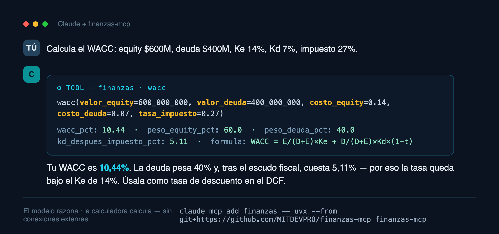

# finanzas-mcp

[](https://github.com/MITDEVPRO/finanzas-mcp/actions/workflows/ci.yml) [](https://pypi.org/project/finanzas-mcp/)

Servidor **MCP** (Model Context Protocol) de **calculadoras financieras genéricas**, en español, para usar con Claude Desktop, Claude Code o cualquier cliente MCP.

**25 herramientas de cálculo puro**: todas operan sobre los datos que tú entregas — el servidor **no se conecta a internet, a bases de datos ni guarda estado**. Sirve para cualquier empresa, en cualquier moneda.

> *Finance calculators as an MCP server (Spanish-first): ratios, DuPont, Altman Z-Score, Piotroski F-Score, WACC, CAPM, DCF, multiples, NPV/IRR, break-even, AR aging, depreciation, loan amortization, indirect cash flow, and Chilean tax helpers (VAT, corporate tax, monetary correction). Pure computation, no external connections.*



## Herramientas

| Módulo | Tools |
|---|---|
| **Ratios y diagnóstico** | `ratios_liquidez` · `ratios_rentabilidad` · `ratios_eficiencia` (DIO/DSO/DPO/CCC) · `ratios_endeudamiento` · `dupont` (3 y 5 factores) · `altman_z_score` (3 variantes) · `piotroski_f_score` · `working_capital` (NOF) |
| **Valoración** | `capm_costo_equity` (con beta Hamada) · `wacc` · `dcf` (con sensibilidad WACC×g) · `valoracion_multiplos` · `van_tir` (VAN, TIR, payback) |
| **Operación** | `punto_equilibrio` · `variacion` (Δ, %, CAGR) · `aging_cartera` · `depreciacion` (lineal/acelerada/suma dígitos) · `amortizacion_credito` (francés/alemán) · `interes_compuesto` · `flujo_caja_indirecto` |
| **Tributario (Chile, parametrizable)** | `iva` · `impuesto_empresa` (14A/14D3/custom) · `correccion_monetaria` · `escudo_fiscal` · `ppm_calculo` |

Convenciones: **tasas en decimales** (`0.10` = 10 %), montos en la moneda que uses, resultados con interpretación incluida donde aporta.

## Instalación

### Claude Desktop / Claude Code (con [uv](https://docs.astral.sh/uv/))

```json
{
  "mcpServers": {
    "finanzas": {
      "command": "uvx",
      "args": ["finanzas-mcp"]
    }
  }
}
```

En Claude Code basta:

```bash
claude mcp add finanzas -- uvx finanzas-mcp
```

### Desde el código clonado

```bash
git clone https://github.com/MITDEVPRO/finanzas-mcp
cd finanzas-mcp
uv run finanzas-mcp        # o: pip install -e . && finanzas-mcp
```

## Ejemplos de uso (en tu cliente MCP)

- *"Calcula la liquidez con activo corriente 850M, pasivo corriente 260M, inventario 420M"*
- *"Valoriza por DCF: FCF 1.200, 1.350, 1.500; WACC 11%; g 2,5%; deuda neta 2.000"*
- *"¿Cuál es el Z-Score? Activos 10.000M, pasivos 6.000M, WC 1.800M, utilidades retenidas 2.500M, EBIT 900M, patrimonio 4.000M"*
- *"Tabla de un crédito de 50M a 60 cuotas, 1,1% mensual, sistema francés"*
- *"Aging de estas facturas: [{monto: 12M, dias_vencido: 45, cliente: 'ACME'}, …]"*

## Desarrollo

```bash
uv run --group dev pytest        # 20 tests de la matemática financiera
```

Estructura: `src/finanzas_mcp/` — `app.py` (instancia FastMCP) + 4 módulos de tools + `server.py` (entry point stdio). SDK oficial [`mcp`](https://github.com/modelcontextprotocol/python-sdk).

## Disclaimer

Los resultados son **referenciales y educativos**: no constituyen asesoría financiera, tributaria ni de inversión. Las tasas tributarias chilenas (IVA 19 %, 14A 27 %, 14D3 25 %) son las vigentes al momento de publicar y son **parametrizables** en cada tool.

## Licencia

[MIT](LICENSE)
